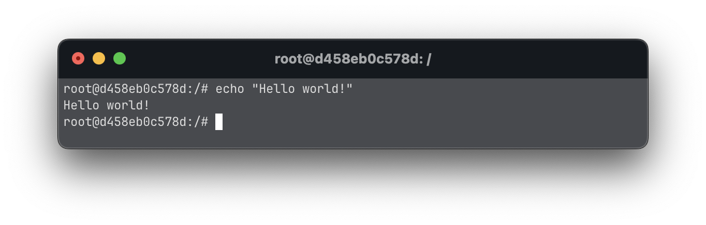

# CLI 

## What is a cli?

CLI is a command line program that accepts text input to execute operating 
system functions.

In linux, the command line uses the bash language

## Bash Features

### Echo command

Echo is a command that is useful for printing into the stdout (the terminal 
console), similar to Java's `System.out.println` or python's `print`



### Brace expansion

Brace expansion, generates a set of alternative combinations.

``` bash
$ echo a{p,c,d,b}e
# ape ace ade abe

$ echo {a,b,c}{d,e,f}
# ad ae af bd be bf cd ce cf
```

It also works with files

```bash
$ echo {1..10}
# 1 2 3 4 5 6 7 8 9 10
```

### Batch mode

To execute multiple commands from a single line, we can use batch mode. To
execute commands in batch mode they must be separated by `;` or on
separate lines.

```bash
$ echo "Hello world"; echo "Hello again"
```

Or

```bash
$ echo "Hello world"
  echo "Hello again"
```

In this case the commands will be executed sequentially. If any of the commands
fail, the others will be executed anyways.

### Concurrent mode

To execute multiple commands at the same time, we can use concurrent mode. To
execute commands in concurrent mode they must be separated by `&`.

```bash
$ echo "Hello world" & echo "Hello at the same time"
```

In this case the commands will be executed in parallel.

### Conditional execution

Sometimes, we want to run commands sequentially but ensuring each command
doesn't fail.

```bash
$ command_that_can_fail && echo "Success" || echo "Something went wrong"
```

### Sleep command

Sleep is a command that as the name says, it sleeps. Is useful when we want to 
wait some time.

```bash
sleep 30
```

Sleeps for 30 seconds

```bash
sleep 0.5h
```

Sleeps for half an hour

### File navigation

Linux has a file system we can navigate. Every time you open a new terminal, it
is started in the root of your user's file system. 

#### Ls command

The `ls` command, list all the child diretories and files in your current directory.

```
$ ls
```

#### Cd command

The `cd` command, short for change directory, lets you navigate to a folder or
directory in your filesystem.

```
$ cd
```

Using `cd` with no arguments, you can move back to the root wherever you are.

```
$ cd <directory>
```

You can move to a child directory using cd with the name of the directory

```
$ cd ..
```

You can move to a parent directory using double dots.

#### Mkdir command

You can create a new subdirectory in the current directory using the `mkdir`
command.

```
$ mkdir files
```

This command creates a new directory `files` in the current directory.

#### Touch command

You can create a new file in the current directory using the `touch` command.

```
$ touch hello.txt
```

This command creates a new file `hello.txt` in the current directory.

#### Cat command

You can print the contents of a file using the `cat` command.

```
$ cat hello.txt
```

This command prints the contents of the `hello.txt` file in the console.

### Redirection operator

You can use redirection operators `>` to write the output of a command into a 
file or `>>` to append the output of a command into an existing file.

```
$ echo "Hello world" > hello.txt
$ cat hello.txt
$ echo "Hello again" >> hello.txt
$ cat hello.txt
```

### Pipe operator

You can use the pipe `|` to connect the output of a command to the input of
another command.

```
echo "Hello world" | cat
```

### Grep

Grep is a command that searches a file for a particular pattern of characters,
and displays all lines rthat contain that pattern. That pattern could be a
literal string or a regular expression.

```
$ grep "unix" intro/assets/grep.txt 
$ grep -i "unix" intro/assets/grep.txt 
$ grep "fun[a-zA-Z]*" intro/assets/grep.txt 
```

The first command searches for the unix word, the second one searches for the
same word but case-unsensitive and the last one searches for any word that
starts with fun.