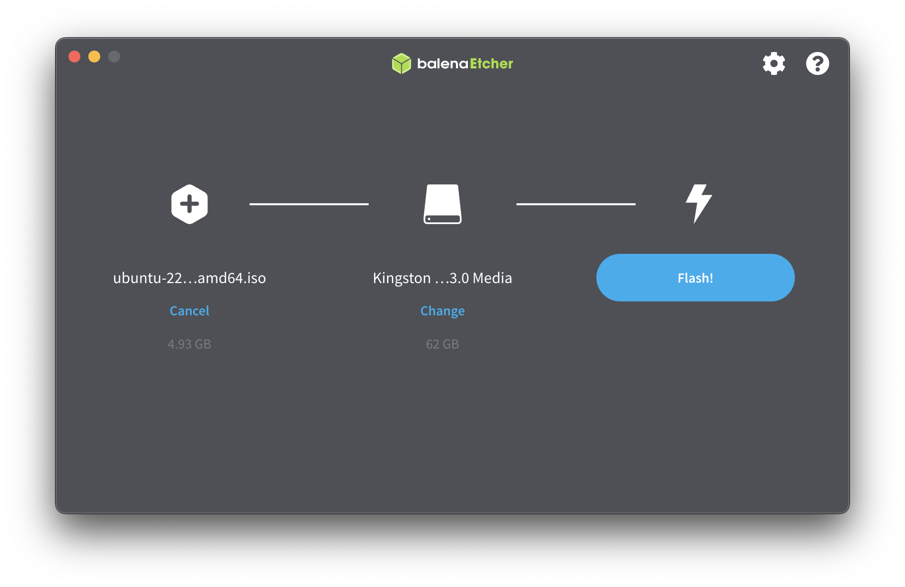

# Linux installation

To install linux we have three options:

1. Install on your machine as a dual-boot with your current operating system.
Be aware that you may loose all your files.

2. Install on your machine replacing your current operating system.
Be aware that you may loose all yor files.

3. Create a bootable USB with linux, you can plug in the USB and boot linux
and remove it to boot your current operating system. This is the recommended
way of installation as there's no risk of loosing your files.

## Creating a bootable USB

The first step to create a bootable USB is to select a Linux distribution.
A few of the available distributions are:

- [Ubuntu](https://ubuntu.com/download/desktop)
- [Linux Mint](https://linuxmint.com/download.php)
- [Pop!_OS](https://pop.system76.com/)

Once you have your `.iso` file, you'll have to create a bootable USB with it.
Get an USB drive with more than 8GB of storage and download
[BalenaEtcher](https://etcher.balena.io/). Balena Etcher is a tool that works 
with Linux MacOS and Windows and it provides a GUI to flash OS images into SD
cards and USB drives.

To create the bootable USB select your downloaded `.iso` file, the device
you want to format and start the flashing process. Make sure to backup your USB
drive contents as it will be formatted during the flashing process.

## Booting from the USB drive

### PC

You can select the startup disk from the startup disk options. On most PCs you
can access startup disk options by pressing F12 while the BIOS is loading.

You can also set a default disk by pressing F2 while the BIOS is loading.

### Mac

As of july 2023, for Apple Silicon Macs there's no linux distro that fully
supports the architexture. There's one distro, Asahi Linux, with an available
alpha thathas most of the basic features working.

Disable startup security:

- If you have a Mac with Apple silicon: Press and hold the power button until
"Loading startup options" appears and select options.

- On other Mac computers: Press and hold `cmd + R` keys as you press the power
button to start up your mac.

- Then in the top bar select Utilities > Startup Security

If no security is available choose that option and also select allow booting
from external media. Else select reduced security.

To change your startup disk once:

- If you have a Mac with Apple silicon: Press and hold the power button until
"Loading startup options" appears.

- On other Mac computers: Press and hold the Option key as you press the power
button to start up your mac.

When the available startup options, select your USB drive.

You can also set a default disk in System Settings > General > Startup Disk.

## Installation setup (Ubuntu example)

- Select try or install ubuntu and wait for the installer to load.

- If you want to run it as a bootable USB select try ubuntu.

- If you want to install ubuntu replacing your current OS or alongside your
current OS, select install ubuntu.

If you have a Mac laptop your trackpad and keyboard might not work with Linux
so be ready to plug in an external mouse and keyboard.
