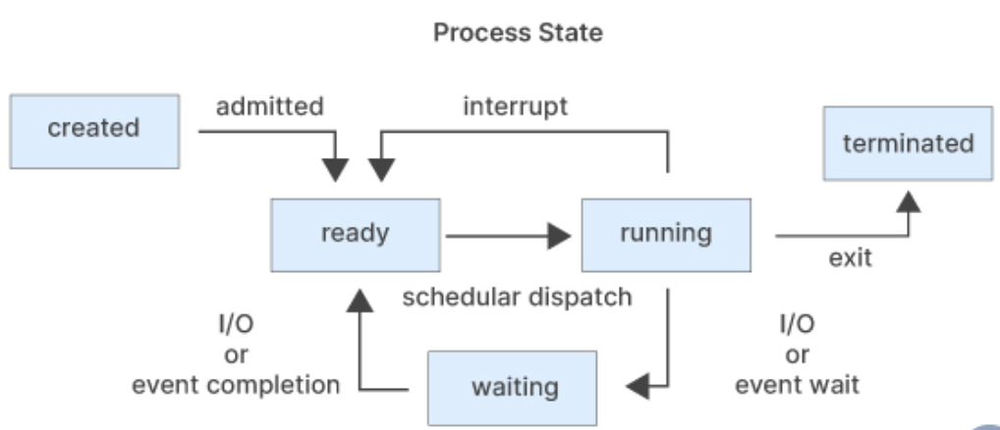
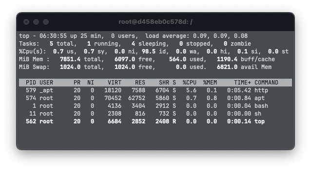
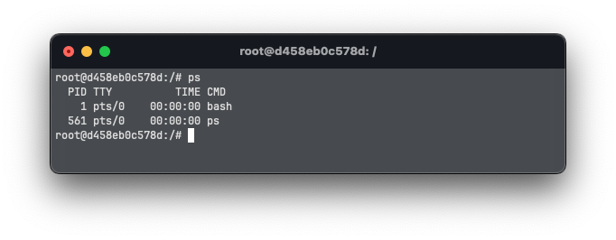
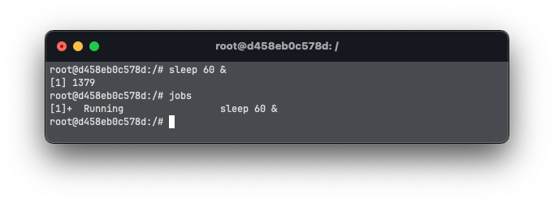
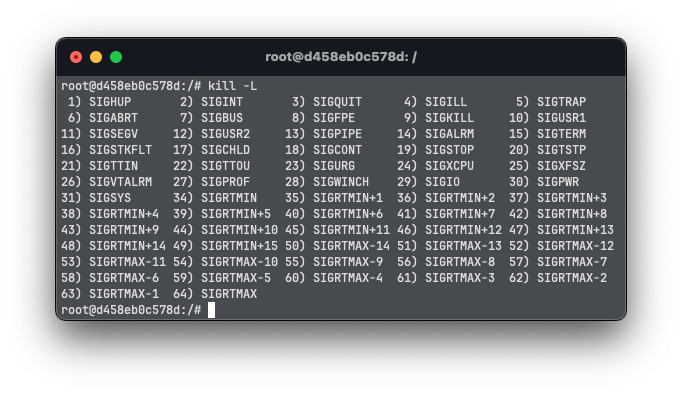
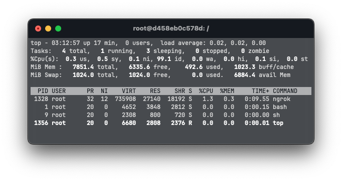
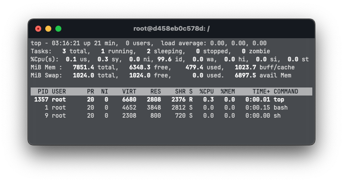
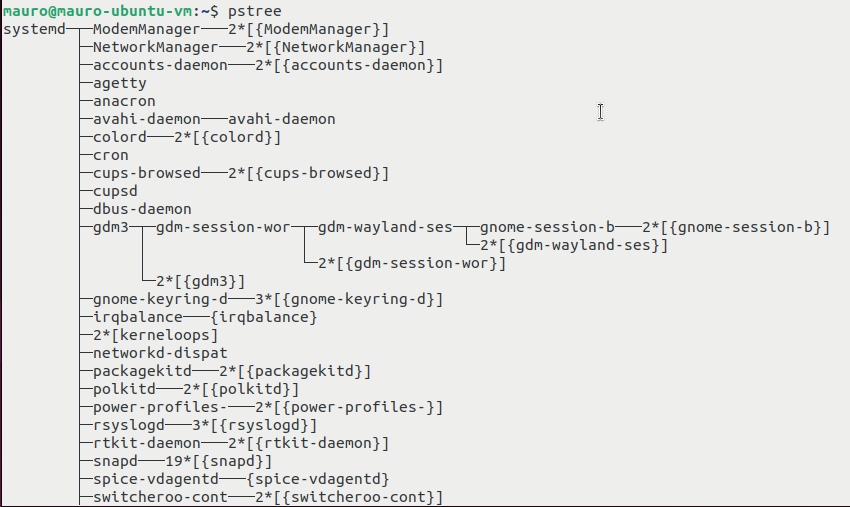

# Process Management

Process management is an essential component of the Linux system.

## Process stages



In Linux, a process goes through several stages during its lifetime. Understanding these stages and checking how they run in the background is important for process management and troubleshooting. The states of a process in Linux are as follows:

- **Created**: A process is created when a program is executed. At this stage, the process is in a "created" state, and its data structures are initialized.

- **Ready**: The process enters the "ready" state when it is waiting to be assigned to a processor by the Linux scheduler. At this stage, the process is waiting for its turn to execute.

- **Running**: The process enters the "running" state when it is assigned to a processor and is actively executing its instructions.

- **Waiting**: The process enters the "waiting" state when it is waiting for some event to occur, such as input/output completion, a signal, or a timer. At this stage, the process is not actively executing its instructions.

- **Terminated**: The process enters the "terminated" state when it has completed its execution or has been terminated by a signal. At this stage, the process data structures are removed, and its resources are freed.

- **Zombie**: A process enters the "zombie" state when it has completed its execution but its parent process has not yet read its exit status. At this stage, the process details still have an entry in the process table, but it does not execute any instructions. The zombie process is removed from the process table when its parent process reads its exit status.

## Foreground and background processes

### Foreground processes

Foreground processes are interactive processes that require user input. These processes are executed in the foreground and are associated with a terminal. Examples of foreground processes include editors, shells, and commands that require user input. The Linux operating system provides several tools to manage foreground processes. One of the most commonly used tools is the shell, which is a command-line interface to the operating system. The shell allows the user to start, stop, pause, and resume foreground processes. It also provides tools to monitor and manage the resources used by these processes, such as virtual memory and CPU usage.

The foreground process can also be managed using signals. A signal is a software interrupt that is sent to a process to request it to take a specific action. For example, the "Ctrl+C" signal is sent to a process to request it to terminate.

### Background processes

Background process management in Linux refers to the management of processes that run in the background and do not require user interaction. These processes are also referred to as non-interactive processes and automatic processes. These processes can be started by the operating system or by a user, and they do not have an associated terminal.

Background processes are typically used for system services and daemon processes that run continuously in the background. They can also be used for running long-running jobs or task lists that do not require user interaction.

Background processes can be started using several methods. One method is to use the "&" symbol at the end of a command, which runs the command in the background. For example, the command `sleep 60 &` starts a process that sleeps for 60 seconds in the background.

## Process Family Tree

In Linux, every process is a descendant of the init process, whose PID is one. Each process has a unique Process ID (PID) assigned to it, and each process may have one or more child processes.

The process family tree in Linux is also known as the Process Hierarchy, which shows the relationship between the parent process and the child process. The parent process is the one that creates a child process, and the child process inherits some attributes from its parent process. 

## Tracking running processes

There are a few commands available in Linux to track running processes:

### Top Command

The `top` command displays a list of processes that are running in real-time
along with their memory and CPU usage. 

The output contains the following data for each running process:

```bash
$ top
```



- **PID**: Unique process ID given to each process.
- **USER**: Username of the process owner.
- **PR**: Priority given to the process while scheduling.
- **NI**: "nice" value of the process.
- **VIRT**: Amount of virtual memory used by a process.
- **RES**: Amount of physical memory used by a process.
- **SHR**: Amount of memory shared with other processes.
- **S**: State of the process.
    - D = uninterruptible sleep
    - R = running
    - S = sleeping
    - T = traced or stopped
    - Z = zombie
- **%CPU**: Percentage of CPU used by the process.
- **%MEM**: Percentage of RAM used by the process.
- **TIME+**: Total CPU time consumed by the process.
- **COMMAND**: Command used to activate the process.

### Ps Command

The `ps` command is short for *Process Status*. It displays the 
currently-running processes. However, unlike the top command, the output
generated is not in real-time.

```bash
$ ps
```

- **PID**: Unique process ID given to each process.
- **TTY**: Terminal type.
- **TIME**: Time the process has been running.
- **CMD**: Command used to activate the process.



You can use `-u` flag to list more information or `-A` flag to list all
processes instead of just the ones that are running.

### Jobs command

The `jobs` command is used to display a list of background jobs running in the
current shell session.

```bash
$ jobs
```



## Move process between background and foreground

We can use the `fg` and `bg` commands to move processes betweeen background and
foreground.

```bash
$ fg [JobID]
$ bg [JobID]
```

These two commands take the id of the job (from the `jobs` output) as am argument.

## Kill processes

To stop a process in Linux, you can use the `kill` command. The kill command
sends a signal to the process.

There are a lot of different types of signals that you can send, however, the
most common one is `kill -9` which is `SIGKILL`.

You can list all available signals using:

```bash
$ kill -L
```



The default signal is 15, which is `SIGTERM`

The syntax for killing a process is:
```bash
$ kill -[signal] [PID]
```

Or you can kill a job:
```bash
$ kill -[signal] %[JobID]
```

## Change priority of a process

In Linux, you can prioritize between processes.The priority for a process is
`Niceness` value. Niceness can range from -20 to 19. 0 beignn the default
value.

To start a process and give it a nice value other than the default one, use:

```bash
$ nice -n [value] [process name]
```

To change a nice value of a process that is already running use:

```bash
$ renice [value] -p [PID]
```

## Example usage

We want to expose our 500 port to the open internet. For that we can use
`ngrok`. This tool assigns a unique url that redirects to a port in localhost.

We also want to run the process with a priority of 8, to not display any output
and to run as a background process so we run the following command:

```bash
$ nice -n 8 ngrok http 500 > /dev/null &
```

Running `top` we can see that our process is running and the priority is 
correctly setted.


Then we realise that we wanted to run our process with a priority of 12.

We can achieve this by getting the PID from the `top` command and running:

```bash
$ renice 12 -p 1328
```

Running `top` again, we can verify that our process has the new priority setted
and keeps all the other information the same.



Finally, we finished our work, so we want to get rid of the process. We can
force kill it by running

```bash
$ kill -9 1328
```

Running `top` one last time, we varify that our process is no longer running.




## Pstree

We can see the hierarchy of the processes in our system using the `pstree`
command.

```
$ pstree
```


