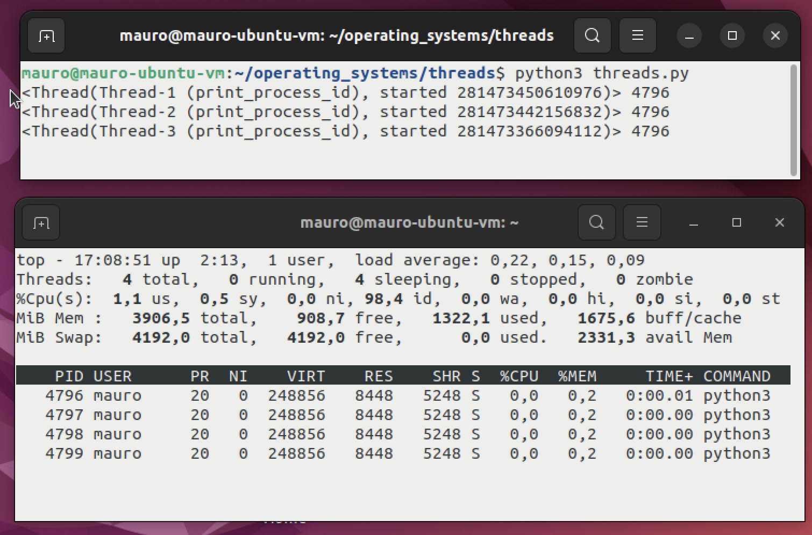

# Threads

in the [./threads.py](./threads.py) file. We have a program that creates
multiple threads at kernel level.

If we run this program, it prints the thread that started and the process 
id that is running this thread.



We can see that the program created 3 threads and all of them are running
in the same process, 4796.

If we run:

```
$ top -H -p 4796
```

We can see the process and its threads running.

